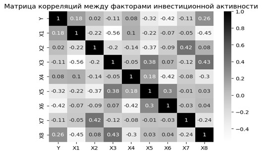
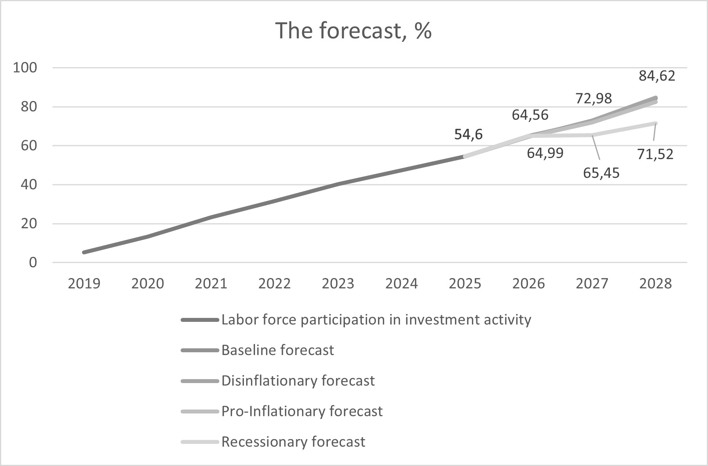

# Labor Force Participation in Investment Activity Forecasting

## Overview

This project investigates the relationship between macroeconomic indicators and labor force participation in investment activity in Russia.

The target variable is defined as:

> Number of retail investors registered on the Moscow Exchange divided by the employed population.

The objective is to identify economically meaningful predictors, build a forecasting model, and generate medium-term scenario forecasts based on data of the Central bank of Russia.

The project combines econometric techniques and machine learning methods, including stationarity testing, Granger causality analysis, regularized regression models, and expanding-window validation.

---

## Research Questions

* Which macroeconomic variables affect investment participation?
* Do these effects appear immediately or with time lags?
* Can regularized regression models improve forecasting accuracy?
* How reliable are medium-term forecasts under different macroeconomic scenarios?

---

## Dataset

### Target Variable

**Y — Labor Force Participation in Investment Activity**

$$
Y = \frac{\text{Number of Retail Investors}}{\text{Employed Population}}
$$


### Explanatory Variables

| Variable | Description                   |
| -------- | ----------------------------- |
| X1       | Real wage growth (%)          |
| X2       | Brent oil price (USD/barrel)  |
| X3       | Average USD/RUB exchange rate |
| X4       | Exports as % of GDP           |
| X5       | Inflation rate (%)            |
| X6       | Average key interest rate (%) |
| X7       | Money supply growth (M2, %)   |
| X8       | Unemployment rate (%)         |

---

## Methodology

### 1. Stationarity Testing

Since the dataset consists of annual time series, all variables were tested for stationarity using the Augmented Dickey-Fuller (ADF) test.

Several variables were found to be non-stationary:

* Y
* X2
* X3
* X4
* X8

To address this issue:

* growth rates were used instead of levels;
* logarithmic differences were applied to the target variable;
* stationarity was re-tested until all series satisfied the ADF criterion.

---

### 2. Correlation Analysis

The correlation matrix below summarizes pairwise relationships between all variables used in the study.

<p align="center">
  
</p>

---

### 3. Granger Causality Analysis

Granger causality tests were conducted using lags of up to two years.

The following statistically significant relationships were identified:

| Variable | Lag | F-test p-value | Chi-square p-value |
|-----------|-----------|-----------|-----------|
| X4 (Exports/GDP) | 2 years | 0.0755 | 0.0082 |
| X5 (Inflation) | 1 year | 0.0289 | 0.0073 |
| X8 (Unemployment) | 2 years | 0.1216 | 0.0239 |

These variables were later incorporated as lagged predictors in the forecasting models.

---

### 4. Expanding Window Validation

To avoid look-ahead bias and mimic real forecasting conditions, a custom expanding-window validation procedure was implemented.

For each iteration:

1. The model was trained on all available historical observations.
2. Forecasts were generated for the following three years.
3. Performance was evaluated using:

* RMSE
* MAPE

Hyperparameters were selected through grid search.

---

## Models Evaluated

### Model 1

All explanatory variables without lags.

**Best Result**

* RMSE = 0.2509
* MAPE = 41.68%

---

### Model 2

Only variables identified through Granger causality analysis.

Lag structure:

* X4 (2-year lag)
* X5 (1-year lag)
* X8 (2-year lag)

**Best Result**

* RMSE = 0.1447
* MAPE = 31.59%

---

### Model 3

All variables plus lagged Granger-significant predictors.

**Best Result**

* RMSE = 0.1304
* MAPE = 25.40%

---

### Elastic Net

Elastic Net regression was evaluated to test whether feature selection could improve performance.

Results showed:

* higher RMSE;
* higher MAPE.

This suggests that all predictors contribute useful information and should not be aggressively penalized.

---

### Recursive Ridge Regression

A lagged version of the target variable was introduced:

$$
Y_t = f(X_t, Y_{t-1})
$$


Forecasts were generated recursively for multi-step prediction.

**Best Result**

* RMSE = 0.1043
* MAPE = 21.04%

This model achieved the best forecasting performance among all tested approaches.

---

## Results

The final model successfully captured the dynamics of investment participation and significantly outperformed alternative specifications.

However, scenario forecasts produced unrealistically high values exceeding 100% participation by 2028.

This outcome likely reflects:

1. Structural changes in investor behavior after 2017.
2. Extraordinary growth of retail investing during 2020–2021.
3. Optimistic assumptions of the CBR embedded in macroeconomic forecast scenarios.

Although absolute values appear overstated, the relative ordering of scenarios remains economically consistent:

* Disinflationary scenario → strongest growth.
* Pro-Inflationary scenario → moderate growth.
* Crisis scenario → weakest growth.

<p align="center">
  
</p>

---

## Project Structure

```text
pythoning/
│
├── analyzing.ipynb          # Main research notebook
├── for_python.xlsx          # Training dataset
├── for_prediction.xlsx      # Scenario assumptions (source: the CBR)
└── result.xlsx              # Forecasting results
```

---

## Technologies

* Python
* Pandas
* NumPy
* Statsmodels
* Scikit-learn
* Matplotlib
* Seaborn

---

## Key Takeaways

* Proper stationarity treatment substantially improved model reliability.
* Lagged macroeconomic effects are important when forecasting investment participation.
* Ridge Regression outperformed Elastic Net in this application.
* Recursive forecasting with autoregressive information produced the most accurate results.
* Structural breaks remain the primary challenge for long-term forecasting.
